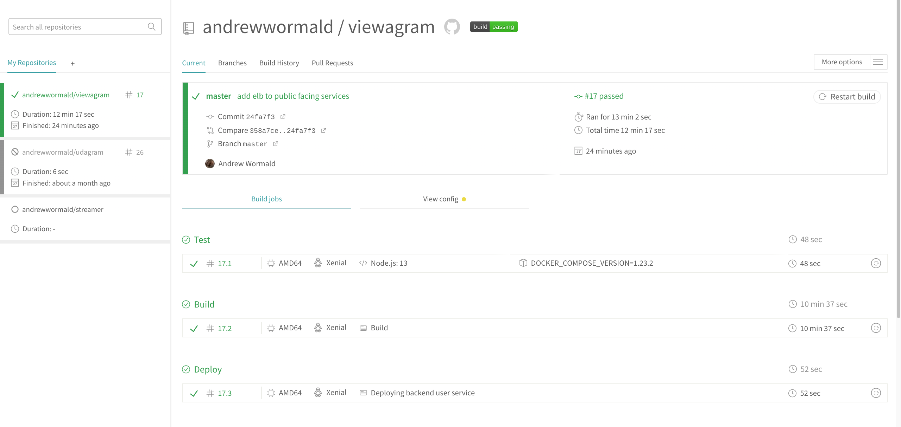
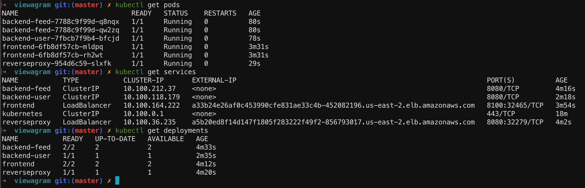
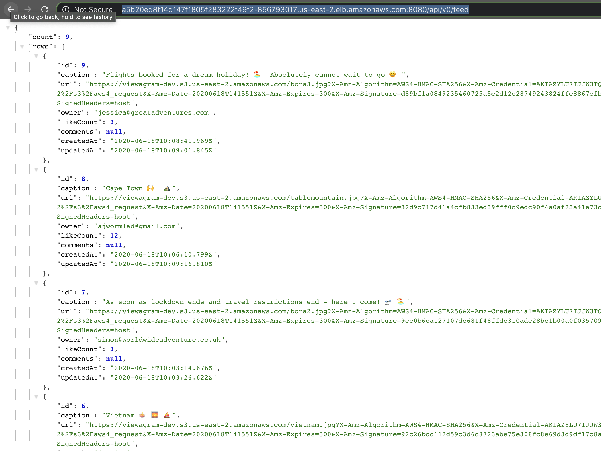

# Viewagram

### Screenshots:

### Github repo:
https://github.com/andrewwormald/viewagram

________
### Dockerhub images:

Found: https://hub.docker.com/r/andrewjameswormald/viewagram/tags

#### Tags for service images are:
- docker push andrewjameswormald/viewagram:feed-latest
- docker push andrewjameswormald/viewagram:user-latest
- docker push andrewjameswormald/viewagram:frontend-latest
- docker push andrewjameswormald/viewagram:reverseproxy-latest
________

### Run your code
1. git add .
2. git commit -m '{{my commit message}}'
3. git push

###### Travis will begin to build master and automatically deploy it (updating the cluster with rolling changes)

###### To test the application running in the eks cluster you will need to run kubectl por-forwarding execs on frontend and the reverseproxy
###### OR
###### use the ELB public IP provided when typing `kubectl get services` for the frontend and reverseproxy services
 
4. `kubectl port-forward services/frontend`
5. `kubectl port-forward services/reverseproxy`
