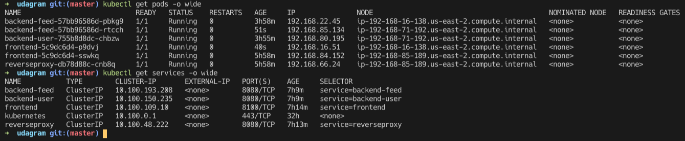

# Udagram

### Screenshots:

### Github repo:
https://github.com/andrewwormald/udagram

________
### Dockerhub images:

Found: https://hub.docker.com/r/andrewjameswormald/udagram/tags

#### Tags for service images are:
- docker push andrewjameswormald/udagram:feed-latest
- docker push andrewjameswormald/udagram:user-latest
- docker push andrewjameswormald/udagram:frontend-latest
- docker push andrewjameswormald/udagram:reverseproxy-latest
________

### Run your code
1. git add .
2. git commit -m '{{my commit message}}'
3. git push

// Travis will begin to build master and automaticall deploy it

// To test the application running in the eks cluster you will need to run kubectl por-forwarding execs on frontend and the reverseproxy

4. `kubectl port-forward services/frontend`
5. `kubectl port-forward services/reverseproxy`
